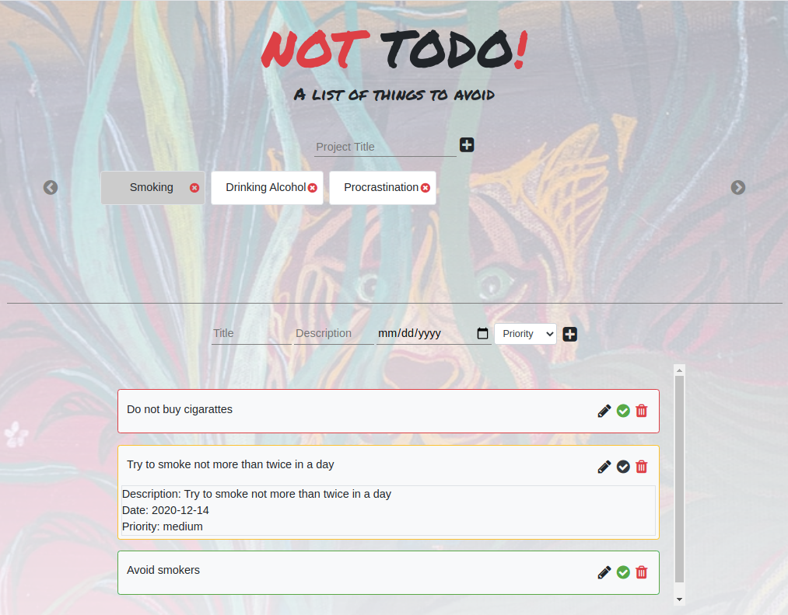

# NOT TODO!

# Project: Not To Do
In this project, we build a simple NOT TODO list application for keeping track of all the things you are tying to avoid. Its intended to help you keep track of your bad habbit, inevitably helping you make better decisions and grately improve your life in the process. It is built purely with Javascript, HTML and CSS. 

<!-- PROJECT LOGO -->
<br />
<p align="center">
  <a href="https://safaerden.github.io/Not-Todo-List/">
    
  </a>

  <h1 align="center">NOT TODO!</h1>

  <p align="center">
    <br />
    <br />
    <a href="https://safaerden.github.io/Not-Todo-List/">View Demo</a>
    ·
    <a href="https://github.com/SafaErden/Not-Todo-List/issues">Report Bug</a>
    ·
    <a href="https://github.com/SafaErden/Not-Todo-List/issues">Request Feature</a>
  </p>
</p>

<br>
<!-- ABOUT THE PROJECT -->

## About The Project

This project's purpose is to practice Javascript. Its built with ES6 while keeping in mind concepts like OOP, Factory Functions and the Module Pattern.



<br>
<br>

<!-- ABOUT THE PROJECT -->
- ## Local Usage

To use this app locally, this is what you need to:

* [Download](https://github.com/SafaErden/Not-Todo-List/archive/master.zip) or clone this repo:
  - Clone with SSH:
  ```
    git@github.com:SafaErden/Not-Todo-List.git
  ```
  - Clone with HTTPS
  ```
    https://github.com/SafaErden/Not-Todo-List.git
  ```
* `cd` into the downloaded folder and run `npm install`

* then run `npm run start`


### Built With
This project was built using these technologies.
* HTML
* CSS
* JavaScript
* Webpack
* Chrome Dev Tools

## Live Version
To try it live [click here](https://safaerden.github.io/Not-Todo-List/)

<!-- CONTACT -->

## Contact

👤 **Phillip Musiime**

- LinkedIn: [Phillip Musiime](https://www.linkedin.com/in/phillip-musiime/)
- GitHub: [PhillipUg](https://github.com/PhillipUg)
- Twitter: [@Phillip_Ug](https://twitter.com/Phillip_Ug)
- E-mail: phillipmusiime@gmail.com

👤 **Safa ERDEN**

- Github: [@SafaErden](https://github.com/SafaErden)
- Twitter: [@safaerden](https://twitter.com/safaerden)
- Linkedin: [@safaerden](https://www.linkedin.com/in/safaerden/)


<!-- ACKNOWLEDGEMENTS -->
## Acknowledgements
* [Microverse](https://www.microverse.org/)


## 📝 License

This project is [MIT](https://opensource.org/licenses/MIT) licensed.
