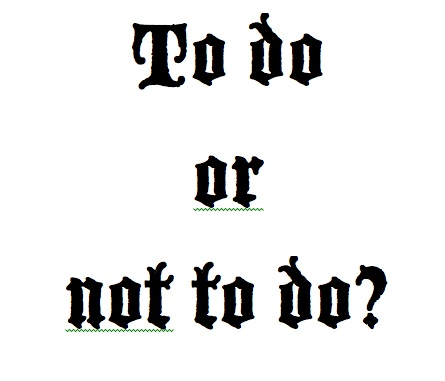

# NOT TODO!

# Project: Not To Do
In this project, we build a simple NOT TODO list application for keeping track of all the things you are tying to avoid. Its intended to help you keep track of your bad habbit, inevitably helping you make better decisions and grately improve your life in the process. It is built purely with Javascript, HTML and CSS. 

<!--
*** Thanks for checking out this README Template. If you have a suggestion that would
*** make this better, please fork the repo and create a pull request or simply open
*** an issue with the tag "enhancement".
*** Thanks again! Now go create something AMAZING! :D
-->

<!-- PROJECT SHIELDS -->
<!--
*** I'm using markdown "reference style" links for readability.
*** Reference links are enclosed in brackets [ ] instead of parentheses ( ).
*** See the bottom of this document for the declaration of the reference variables
*** for contributors-url, forks-url, etc. This is an optional, concise syntax you may use.
*** https://www.markdownguide.org/basic-syntax/#reference-style-links
-->
[![Contributors][contributors-shield]][contributors-url]
[![Forks][forks-shield]][forks-url]
[![Stargazers][stars-shield]][stars-url]
[![Issues][issues-shield]][issues-url]

<!-- PROJECT LOGO -->
<br />
<p align="center">
  <a href="https://safaerden.github.io/Not-Todo-List/">
    
  </a>

  <h1 align="center">NOT TODO!</h1>

  <p align="center">
    <br />
    <br />
    <a href="https://safaerden.github.io/Not-Todo-List/">View Demo</a>
    ·
    <a href="https://github.com/PhillipUg/not-todo-list/issues">Report Bug</a>
    ·
    <a href="https://github.com/PhillipUg/not-todo-list/issues">Request Feature</a>
  </p>
</p>

<!-- TABLE OF CONTENTS -->
## Table of Contents

* [About the Project](#about-the-project)
  * [Built With](#built-with)
* [Live Version](#live-version)
* [Contact](#contact)
* [Acknowledgements](#acknowledgements)
* [License](#license)

<br>
<br>
<!-- ABOUT THE PROJECT -->

## About The Project

This project's purpose is to practice Javascript. Its built with ES6 while keeping in mind concepts like OOP, Factory Functions and the Module Pattern.

![Product Name Screen Shot][product-screenshot]
<br>
<br>

<!-- ABOUT THE PROJECT -->
- ## Local Usage

To use this app locally, this is what you need to:

* [Download](https://github.com/PhillipUg/not-todo-list/archive/master.zip) or clone this repo:
  - Clone with SSH:
  ```
    git@github.com:PhillipUg/not-todo-list.git
  ```
  - Clone with HTTPS
  ```
    https://github.com/PhillipUg/not-todo-list.git
  ```
* `cd` into the downloaded folder and run `npm install`

* then run `npm run start`


### Built With
This project was built using these technologies.
* HTML
* CSS
* JavaScript
* Webpack
* Chrome Dev Tools

## Live Version
To try it live [click here](https://phillipug.github.io/not-todo-list/)

<!-- CONTACT -->

## Contact

👤 **Phillip Musiime**

- LinkedIn: [Phillip Musiime](https://www.linkedin.com/in/phillip-musiime/)
- GitHub: [PhillipUg](https://github.com/PhillipUg)
- Twitter: [@Phillip_Ug](https://twitter.com/Phillip_Ug)
- E-mail: phillipmusiime@gmail.com

👤 **Safa ERDEN**

- Github: [@SafaErden](https://github.com/SafaErden)
- Twitter: [@safaerden](https://twitter.com/safaerden)
- Linkedin: [@safaerden](https://www.linkedin.com/in/safaerden/)


<!-- ACKNOWLEDGEMENTS -->
## Acknowledgements
* [Microverse](https://www.microverse.org/)

<!-- MARKDOWN LINKS & IMAGES -->
<!-- https://www.markdownguide.org/basic-syntax/#reference-style-links -->
[contributors-shield]: https://img.shields.io/github/contributors/PhillipUg/not-todo-list.svg?style=flat-square
[contributors-url]: https://github.com/PhillipUg/not-todo-list/graphs/contributors
[forks-shield]: https://img.shields.io/github/forks/PhillipUg/not-todo-list.svg?style=flat-square
[forks-url]: https://github.com/PhillipUg/not-todo-list/network/members
[stars-shield]: https://img.shields.io/github/stars/PhillipUg/not-todo-list.svg?style=flat-square
[stars-url]: https://github.com/PhillipUg/not-todo-list/stargazers
[issues-shield]: https://img.shields.io/github/issues/PhillipUg/not-todo-list.svg?style=flat-square
[issues-url]: https://github.com/PhillipUg/not-todo-list/issues
[product-screenshot]: dist/images/todo.png


## 📝 License

This project is [MIT](https://opensource.org/licenses/MIT) licensed.
